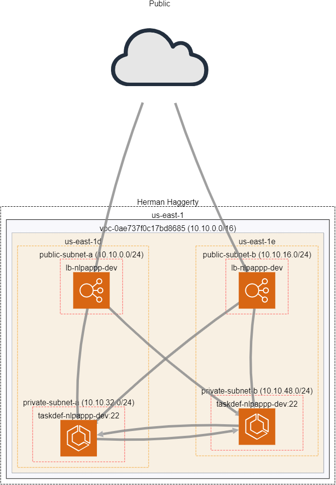

<div align="center">

<h3 align="center">JokerProject</h3>

</div>


<!-- TABLE OF CONTENTS -->
<details>
  <summary>Table of Contents</summary>
  <ol>
    <li>
      <a href="#about-the-project">About The Project</a>
      <ul>
        <li><a href="#built-with">Built With</a></li>
      </ul>
    </li>
    <li>
      <a href="#getting-started">Getting Started</a>
      <ul>
        <li><a href="#prerequisites">Prerequisites</a></li>
        <li><a href="#installation">Installation</a></li>
      </ul>
    </li>
    <li><a href="#usage">Usage</a></li>
    <li><a href="#overview">Overview</a></li>
  </ol>
</details>


<!-- ABOUT THE PROJECT -->
## About The Project

This project a basic design of a scalable web3 application. Its infrastructure is deployed on AWS. 


<p align="right">(<a href="#top">back to top</a>)</p>


### Built With

* AWS
* Terraform
* Docker
* React
* Ethereum

<p align="right">(<a href="#top">back to top</a>)</p>

<!-- GETTING STARTED -->
## Getting Started

### Prerequisites

* AWS Account
    - This project will use your AWS credential configuration locally on your machine, makes sure your IAM user/role has admin level privileges to create AWS resources  

* Terraform
* Docker 

    
<!-- USAGE EXAMPLES -->
## Usage


```bash
  This script builds out the entire Project, by running all needed Terraform deployments.
  
  Syntax: ./bootstrap.sh [-a|h]
  options:
  a     Creates, tests or destroy the Project. *NOTE* Choices are  (create|destroy)
  h     Print this Help.

```

### Creating Project

This command will create all Terraform Resources and run the functional tests for this project and output the URL.
```bash
./bootstrap.sh -a create
```
### Testing Functionailty

Looks for the `alb_url` output from the `appinfra` Terraform deployment and you should be able to access the application from the browser.


### Destroying Project
This command will go through each Terraform folder and run `Terraform destroy` for each project.
```bash
./bootstrap.sh -a destroy
```
<p align="right">(<a href="#top">back to top</a>)</p>

## Overview
This Terraform implementation is a set of 2 containerized app servers deployed using ECS Fargate with each container process deployed to its own private subnet in a Highly Available VPC (2 private subnets, 2 public subnets across 2 AZs); the app servers are also fronted by an Elastic Load balancer (ALB) deployed to the VPC across the public subnets.  Also, to showcase a CI/CD implementation, I created a pipeline that builds the API Server image and deploys new containers.

<p align="right">(<a href="#top">back to top</a>)</p>

### Project Structure

Each folder at the root level represents its own Git repository; separated by logical resource usage i.e 2 infrastructure repos (networking, appinfra) and 1 repo containing the application (JoksterPool-frontend).
This approach is mainly beneficial for resource denomination and resuability when scaling to incorporate other applications that may need to share the same resources (via Terraform remote states).

Also, each of the infrastructure repos contain `backends/<environment>.backend` and `vars/<environment>.tfvars`. This allows replication of the same infrastructure across multiple environments (DEV, TEST, PROD).
With this concept and a bit of refactoring, this could be changed to a Multi-Regional deployment.

#### Infrastructure 



#### Application
This application is a web3 application I built during a cohort on ethereum application development from [buildspace.so](buildspace.so). Its a web3 application that lets users submit jokes to the blockchain and allows others to rate the joke. The application is deployed on the Rinkeby testnet; which unfortunately, does not exist anymore so the application is not functional. However, the application will still prompt for a wallet connection and allow you to view the application.

#### CI/CD
The CI/CD pipeline is built using GitHub Actions. The pipeline is triggered on a push to the master branch. The pipeline will build the docker image, push to ECR and deploy the new image to ECS.

### Future Improvements
- Write tests for the application
- Implement a CI/CD pipeline for the infrastructure repos
- Refactor the Terraform logic to handle Multi-Region deployments for improving Disater Recovery Strategy
- Better logging, implement monitoring system
- Add an EC2 SSH bastion to the public subnet that connected to ECS instances in private subnets allowing administration